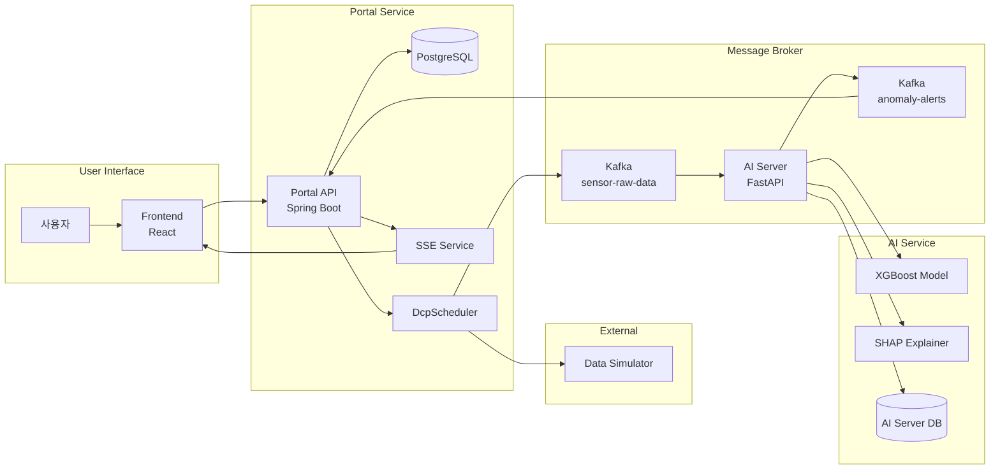

# Real-time Smart Factory Predictive Maintenance MSA System

실시간 스마트 팩토리 예지보전 마이크로서비스 아키텍처(MSA) 시스템


## 프로젝트 개요

제조 환경의 설비(Machine)에서 발생하는 센서 데이터를 실시간으로 수집하고, XGBoost 기반 머신러닝 모델을 활용하여 이상 징후를 탐지하는 시스템입니다. 이상 탐지 시 SSE(Server-Sent Events)를 통해 클라이언트에게 실시간 알림을 전송합니다.

이 프로젝트에서 실시간 데이터 수집은 데이터 시뮬레이터를 사용했습니다. https://github.com/Hyuk0816/data-simulator


### 주요 특징

- **MSA 아키텍처**: Portal, AI Server, Frontend로 분리된 마이크로서비스 구조
- **실시간 이상 탐지**: XGBoost 모델 기반 98% 정확도의 이상 탐지
- **이벤트 기반 처리**: Kafka를 통한 비동기 메시지 처리
- **실시간 알림**: SSE를 활용한 실시간 이상 알림 시스템
- **단계별 심각도**: WARNING, ALERT, CRITICAL 3단계 위험도 분류
- **SHAP 기반 설명**: 이상 탐지 시 파라미터별 기여도 설명 제공
- **Docker 기반 배포**: Docker Compose를 통한 통합 환경 구축

## 시스템 아키텍처

상세한 이벤트 시퀀스 다이어그램은 [Sequence-Diagrams.md](./Sequence-Diagrams.md)를 참조하세요.



### 주요 이벤트 흐름

| # | 이벤트 | 설명 |
|---|--------|------|
| 1 | 설비 등록 | User → Frontend → Portal API → DB |
| 2 | DCP 설정 등록 | User → Frontend → Portal API → DB → Scheduler 시작 |
| 3-1 | 센서 데이터 수집 | Scheduler → External API → Kafka → Portal 영속화 |
| 3-2 | 이상 탐지 분석 | Kafka Consumer → 전처리 → XGBoost → SHAP 분석 |
| 3-3 | 이상 알림 전파 | AI Server → Kafka → Portal → SSE → Frontend Toast |

## 프로젝트 구조

```
machine_anomoly_msa_prj/
├── portal/                          # Spring Boot 백엔드 서비스
│   ├── src/main/java/dev/study/portal/
│   │   ├── controller/              # REST API 컨트롤러
│   │   │   ├── MachineController.java
│   │   │   ├── DcpConfigController.java
│   │   │   ├── AnomalyHistoryController.java
│   │   │   ├── MachineSensorDataController.java
│   │   │   └── sse/SseController.java
│   │   ├── service/                 # 비즈니스 로직
│   │   ├── entity/                  # JPA 엔티티
│   │   ├── dto/                     # 데이터 전송 객체
│   │   ├── repository/              # JPA 레포지토리
│   │   └── common/exception/        # 예외 처리
│   └── Dockerfile
│
├── ai-server/                       # FastAPI AI 서버
│   ├── src/
│   │   ├── api/                     # REST API 라우터
│   │   ├── ml/                      # ML 모델 로더 및 예측기
│   │   ├── preprocessing/           # 센서 데이터 전처리
│   │   ├── kafka/                   # Kafka Producer/Consumer
│   │   ├── cache/                   # 머신 타입 캐시
│   │   ├── db/                      # Outbox 패턴 DB
│   │   └── config.py                # 설정 관리
│   ├── main.py                      # FastAPI 메인 애플리케이션
│   ├── run_consumer.py              # Kafka Consumer 실행
│   └── Dockerfile
│
├── ai-model/                        # ML 모델 학습 및 아티팩트
│   ├── models/                      # 학습된 모델 파일
│   │   ├── final_model_xgboost.pkl
│   │   ├── scaler.pkl
│   │   ├── label_encoder_type.pkl
│   │   └── feature_names.pkl
│   └── notebooks/                   # 학습 노트북
│
├── frontend/                        # React 프론트엔드
│   ├── src/
│   │   ├── api/                     # API 클라이언트
│   │   ├── hooks/                   # React Query 훅
│   │   ├── components/              # UI 컴포넌트
│   │   ├── features/                # 기능별 컴포넌트
│   │   ├── contexts/                # React Context
│   │   └── types/                   # TypeScript 타입
│   └── Dockerfile
│
├── docker-compose.yml               # Docker Compose 구성
├── .env_portal                      # Portal 환경 변수
├── .env_ai_server                   # AI Server 환경 변수
└── .env_frontend                    # Frontend 환경 변수
```

## 기술 스택

### Backend (Portal)
- **Framework**: Spring Boot 3.x
- **Language**: Java 17
- **ORM**: Spring Data JPA (Hibernate)
- **Database**: PostgreSQL 17
- **Message Broker**: Apache Kafka
- **Real-time**: Server-Sent Events (SSE)
- **API Documentation**: Swagger/OpenAPI 3.0

### AI Server
- **Framework**: FastAPI
- **Language**: Python 3.11
- **ML Model**: XGBoost
- **Data Processing**: NumPy, Pandas, scikit-learn
- **Explainability**: SHAP (SHapley Additive exPlanations)
- **Message Broker**: kafka-python

### Frontend
- **Framework**: React 18
- **Language**: TypeScript
- **Build Tool**: Vite
- **State Management**: React Query (TanStack Query)
- **HTTP Client**: Axios
- **UI Components**: shadcn/ui
- **Styling**: Tailwind CSS
- **Charts**: Recharts

### Infrastructure
- **Containerization**: Docker, Docker Compose
- **Message Broker**: Apache Kafka + Zookeeper
- **Database**: PostgreSQL 17
- **Monitoring**: Kafka UI

## 주요 기능 로직

### 1. 설비(Machine) 관리

설비 정보를 CRUD로 관리합니다. 각 설비는 타입(LOW, MEDIUM, HIGH)을 가지며, 이 타입은 AI 모델의 입력 특징으로 사용됩니다.

설비의 베이스는 아래 링크의 캐글 프로젝트의 데이터 기반으로 설계하였습니다. 

https://www.kaggle.com/datasets/shivamb/machine-predictive-maintenance-classification

```
설비 타입 (Type Enum):
- LOW: 저부하 설비
- MEDIUM: 중부하 설비
- HIGH: 고부하 설비
```

### 2. 데이터 수집 계획(Data Collect Plan Config)

각 설비별로 센서 데이터 수집 설정을 관리합니다. 설정이 생성되면 동적 스케줄러가 시작되어 주기적으로 외부 API에서 데이터를 수집합니다.

```
DCP Config 설정:
- machineId: 대상 설비 ID
- collectInterval: 수집 주기 (초)
- apiEndpoint: 데이터 수집 API 엔드포인트
```

### 3. 센서 데이터 처리 파이프라인

```
[Data Simulator/External API]
    │
    ▼ HTTP (DCP 구성에서 설정한 데이터 수집 시간에 따른 Polling)
[Portal - DcpConfigScheduler]
    │
    ▼ Kafka (sensor-raw-data)
[AI Server - SensorDataConsumer]
    │
    ├─1. 센서 데이터 수신
    │
    ├─2. 머신 타입 조회 (Cache → Portal DB)
    │
    ├─3. 전처리 (SensorDataPreprocessor)
    │   - 5개 파생 특징 생성 (공학적 특징 기반) 
    │   - Feature Scaling
    │   - Type Encoding
    │
    ├─4. XGBoost 모델 예측
    │   - 이상 확률 계산
    │   - SHAP 기여도 분석 (이상 시)
    │
    └─5. 이상 감지 시 처리
        ├─ Outbox 테이블 저장
        └─ Kafka 발행 (anomaly-alerts)
```

### 4. 이상 탐지 알고리즘

**XGBoost 모델 특징**:
- Test Accuracy: 98.0%
- F1-Score: 0.7436
- SMOTE를 통한 클래스 불균형 처리

**입력 특징 (10개)**:
- 원본 특징 (5개): airTemperature, processTemperature, rotationalSpeed, torque, toolWear
- 파생 특징 (5개): Temp_diff, Power, Tool_wear_rate, Torque_speed_ratio, Temp_toolwear

**심각도 분류**:
```python
if anomaly_probability >= 0.7:
    severity = "CRITICAL"  # 위험
elif anomaly_probability >= 0.5:
    severity = "ALERT"     # 주의
elif anomaly_probability >= 0.3:
    severity = "WARNING"   # 경고
```

### 5. 실시간 알림 시스템 (SSE)

```
[AI Server]
    │
    ▼ Kafka (anomaly-alerts)
[Portal - AnomalyAlertListener]
    │
    ├─ AnomalyHistory 영속화 (AI 서버에서 이상탐지 된 센서 데이터와 Machine ID를 저장) 
    │
    └─ SseEmitterService.broadcast()
        │
        ▼ SSE Event (anomaly-alert, 모든 프론트 컴포넌트에서 이상 탐지 알림 이벤트 발생)
[Frontend - useAnomalySse Hook]
    │
    └─ Toast 알림 표시
```

**SSE 이벤트 구조**:
```json
{
  "machineId": 1,
  "machineName": "CNC Machine 1",
  "detectedAt": "2025-11-27T18:30:00",
  "severity": "CRITICAL",
  "anomalyProbability": 0.85
}
```

### 6. 센서 데이터 조회 및 시각화

Frontend에서 특정 설비의 센서 데이터를 기간별로 조회하고 차트 및 테이블로 시각화합니다.

- **시계열 차트**: Recharts를 활용한 센서 값 추이 그래프
- **테이블 뷰**: 상세 센서 데이터 목록
- **CSV 내보내기**: CSV로 데이터 내보내기 (후에 모델 학습을 위한)

## 실행 방법

### 사전 요구사항

- Docker & Docker Compose
- Node.js 20+ (프론트엔드 로컬 개발 시)
- Java 17+ (Portal 로컬 개발 시)
- Python 3.11+ (AI Server 로컬 개발 시)

### Docker Compose 실행

```bash
# 전체 서비스 실행
docker-compose up -d

# 로그 확인
docker-compose logs -f

# 특정 서비스 로그
docker-compose logs -f portal
docker-compose logs -f ai-server-consumer

# 서비스 중지
docker-compose down
```

### 서비스 접속 정보

| 서비스 | URL | 설명 |
|--------|-----|------|
| Frontend | http://localhost:5173 | React 웹 애플리케이션 |
| Portal API | http://localhost:8080 | Spring Boot REST API |
| Portal Swagger | http://localhost:8080/swagger-ui.html | API 문서 |
| AI Server API | http://localhost:8000 | FastAPI REST API |
| AI Server Docs | http://localhost:8000/docs | FastAPI Swagger |
| Kafka UI | http://localhost:8090 | Kafka 모니터링 |
| PostgreSQL | localhost:5432 | 데이터베이스 |

## 환경 변수

### Portal (.env_portal)
```properties
SPRING_DATASOURCE_URL=jdbc:postgresql://postgres:5432/machine_anomaly
SPRING_DATASOURCE_USERNAME=admin
SPRING_DATASOURCE_PASSWORD=admin1234
SPRING_KAFKA_BOOTSTRAP_SERVERS=kafka:29092
```

### AI Server (.env_ai_server)
```properties
# Portal DB (머신 타입 조회)
DB_HOST=postgres
DB_PORT=5432
DB_NAME=machine_anomaly
DB_USER=admin
DB_PASSWORD=admin1234

# AI Server DB (Outbox)
AI_DB_HOST=postgres
AI_DB_PORT=5432
AI_DB_NAME=machine_anomaly_ai_server
AI_DB_USER=admin
AI_DB_PASSWORD=admin1234

# Kafka
KAFKA_BOOTSTRAP_SERVERS=kafka:29092
KAFKA_TOPIC_SENSOR=sensor-raw-data
KAFKA_TOPIC_ALERT=anomaly-alerts
KAFKA_GROUP_ID=ai-anomaly-detector

# 심각도 임계값
WARNING_THRESHOLD=0.3
ALERT_THRESHOLD=0.5
CRITICAL_THRESHOLD=0.7
```

## API 문서

상세한 API 명세는 [Api-docs.md](./Api-docs.md)를 참조하세요.

## 테스트

테스트 코드:
- `MachineServiceTest` - 설비 서비스 테스트 (11개 케이스)
- `DcpConfigServiceTest` - DCP 설정 서비스 테스트 (14개 케이스)
