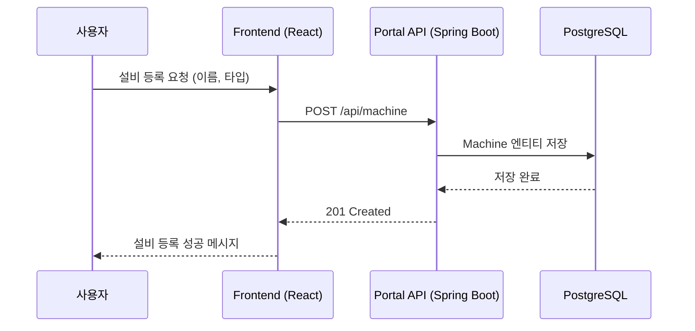
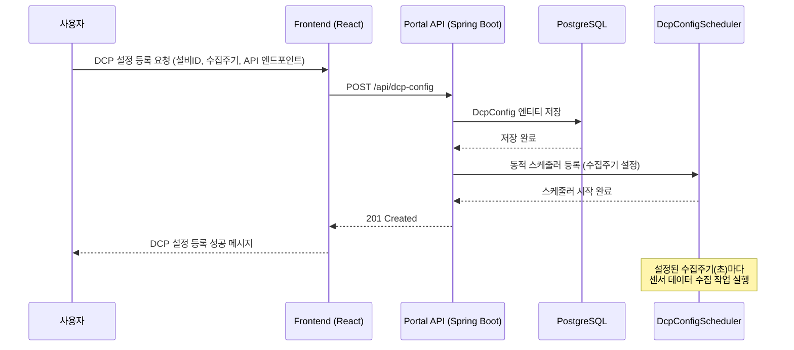
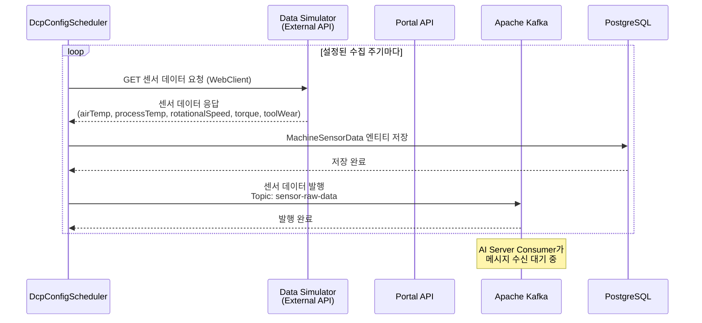
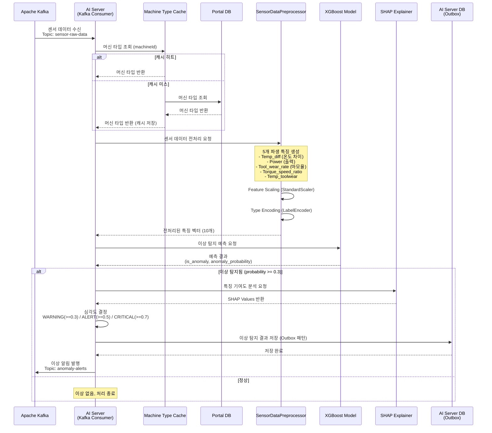
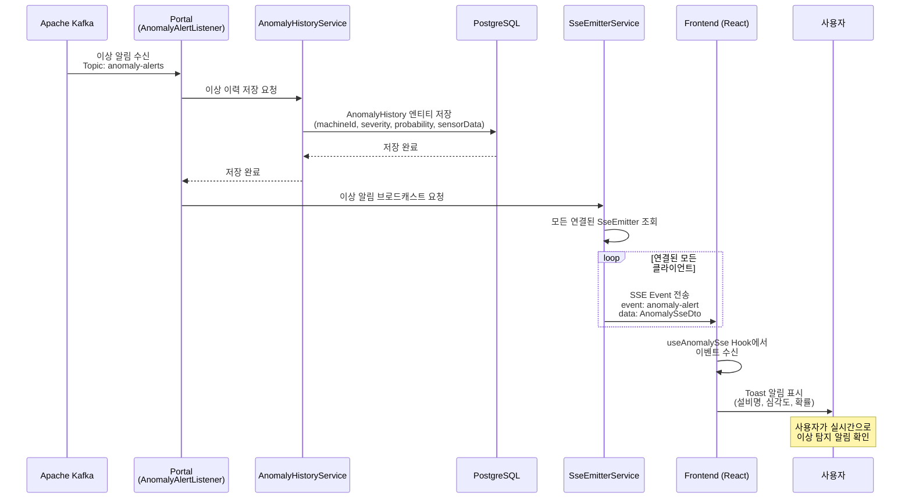
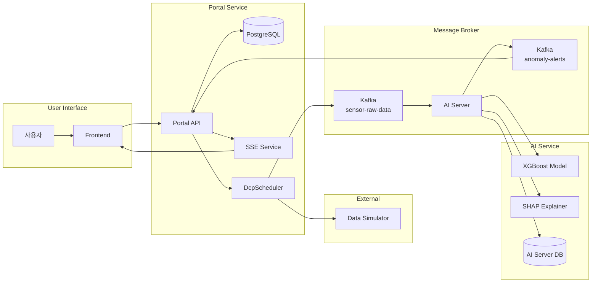

# 시스템 이벤트 시퀀스 다이어그램

실시간 스마트 팩토리 예지보전 MSA 시스템의 주요 이벤트 흐름을 시퀀스 다이어그램으로 설명합니다.

## 목차

- [1. 설비 등록](#1-설비-등록)
- [2. DCP 설정 등록](#2-dcp-설정-등록)
- [3-1. 센서 데이터 수집](#3-1-센서-데이터-수집)
- [3-2. 이상 탐지 분석](#3-2-이상-탐지-분석)
- [3-3. 이상 알림 전파](#3-3-이상-알림-전파)

---

## 1. 설비 등록

### 이벤트 시퀀스 다이어그램



### Description

사용자가 새로운 설비를 시스템에 등록합니다.

설비는 이름(name)과 타입(LOW, MEDIUM, HIGH)을 가지며, 타입은 AI 모델의 입력 특징으로 사용됩니다.

설비 타입은 Kaggle의 Predictive Maintenance 데이터셋을 기반으로 설계되었습니다.

---

## 2. DCP 설정 등록

### 이벤트 시퀀스 다이어그램



### Description

사용자가 특정 설비에 대한 데이터 수집 계획(DCP)을 설정합니다.

DCP 설정에는 대상 설비 ID, 데이터 수집 주기(초), 외부 센서 데이터 API 엔드포인트가 포함됩니다.

설정이 저장되면 동적 스케줄러(DcpConfigScheduler)가 즉시 시작되어 설정된 주기마다 센서 데이터를 수집합니다.

---

## 3-1. 센서 데이터 수집

### 이벤트 시퀀스 다이어그램



### Description

DcpConfigScheduler가 설정된 주기마다 외부 API(Data Simulator)에서 센서 데이터를 수집합니다.

수집된 센서 데이터는 다음 5가지 원본 특징을 포함합니다:
- **airTemperature**: 대기 온도 (K)
- **processTemperature**: 공정 온도 (K)
- **rotationalSpeed**: 회전 속도 (rpm)
- **torque**: 토크 (Nm)
- **toolWear**: 공구 마모 (min)

수집된 데이터는 Portal DB에 영속화되고, Kafka의 `sensor-raw-data` 토픽으로 발행되어 AI Server에서 분석됩니다.

---

## 3-2. 이상 탐지 분석

### 이벤트 시퀀스 다이어그램



### Description

AI Server의 Kafka Consumer가 `sensor-raw-data` 토픽에서 센서 데이터를 수신하여 이상 탐지 분석을 수행합니다.

**전처리 단계**:
1. 머신 타입 조회 (캐시 우선, 없으면 Portal DB 조회)
2. 5개 파생 특징 생성 (공학적 도메인 지식 기반)
3. StandardScaler를 통한 Feature Scaling
4. LabelEncoder를 통한 타입 인코딩

**예측 단계**:
- XGBoost 모델이 10개 특징을 입력받아 이상 확률 계산
- 이상 확률이 30% 이상이면 이상으로 판정

**이상 탐지 시**:
- SHAP을 통해 각 특징의 기여도 분석
- 심각도 분류: WARNING(30%↑), ALERT(50%↑), CRITICAL(70%↑)
- Outbox 패턴으로 DB 저장 후 Kafka 발행

---

## 3-3. 이상 알림 전파

### 이벤트 시퀀스 다이어그램



### Description

AI Server에서 발행한 이상 알림이 Portal을 통해 클라이언트에게 실시간으로 전파됩니다.

**Portal 처리**:
1. AnomalyAlertListener가 Kafka `anomaly-alerts` 토픽 수신
2. AnomalyHistory 엔티티로 이상 이력 영속화
3. SseEmitterService를 통해 모든 연결된 클라이언트에 브로드캐스트

**SSE 이벤트 구조**:
```json
{
  "machineId": 1,
  "machineName": "CNC Machine 1",
  "detectedAt": "2025-11-27T18:30:00",
  "severity": "CRITICAL",
  "anomalyProbability": 0.85
}
```

**Frontend 처리**:
1. useAnomalySse 커스텀 훅이 SSE 이벤트 수신
2. 연결 끊김 시 5초 후 자동 재연결
3. Toast 컴포넌트를 통해 사용자에게 시각적 알림 표시

---

## 전체 시스템 흐름 요약

